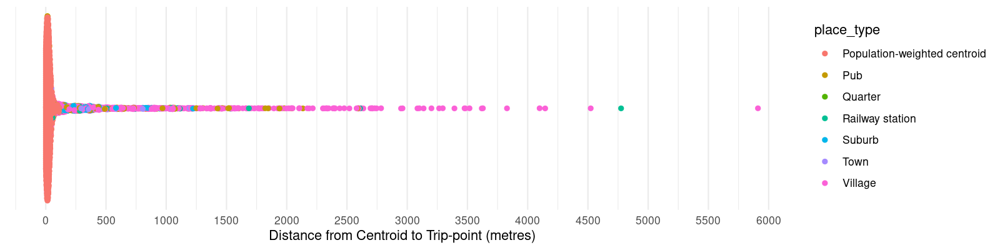

# LSOA11 Trip-points for Wales and Bordering Areas

This repository contains geographical trip-points for each 2011 Lower Layer Super Output Area (LSOA11) in Wales, and some LSOA11s in bordering areas in England, for transport-related analysis.

You can find [the code used to generate these trip-points, and some discussion of the advantages of disadvantages of using these trip-points, here](https://github.com/stupidpupil/wales_lsoa_trip_points/tree/main).

You probably want to download `lsoa11_nearest_road_points.geojson` - these are the final trip-points.

## Distance of Trip-points from Centroids

The plot below shows the distance of the trip-point from the population-weighted centroids for each LSOA.

## License

The trip-points are made available under the [ODbL v1.0](https://opendatacommons.org/licenses/odbl/1-0/) by Adam Watkins.

The trip-points are derived from several datasets provided by the Office for National Statistics licensed under the Open Government Licence v.3.0 and contain OS Data © Crown copyright and database right 2021.

These datasets include:
\- [LSOA11 Population-Weighted Centroids](https://geoportal.statistics.gov.uk/datasets/ons::lower-layer-super-output-areas-december-2011-population-weighted-centroids/about)
\- [LSOA11 Boundaries](https://geoportal.statistics.gov.uk/datasets/ons::lower-layer-super-output-areas-december-2011-boundaries-super-generalised-clipped-bsc-ew-v3/about)

They are also derived from information about places and roads obtained from [OpenStreetMap contributors](https://www.openstreetmap.org/copyright), via [Geofabrik.de](https://download.geofabrik.de/europe/great-britain.html), under the [ODbL v1.0](https://opendatacommons.org/licenses/odbl/1-0/).
